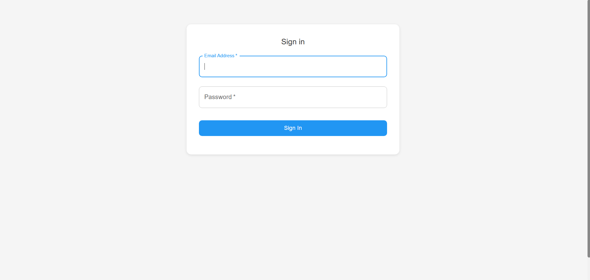
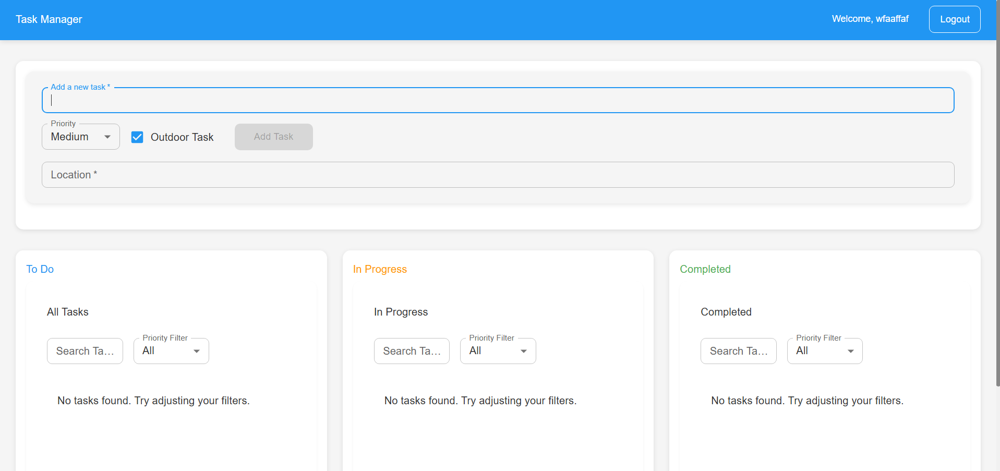
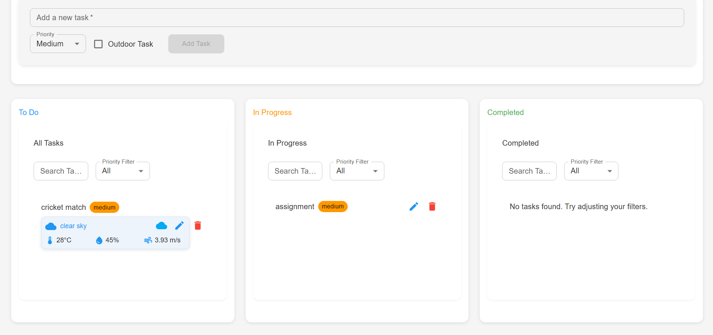
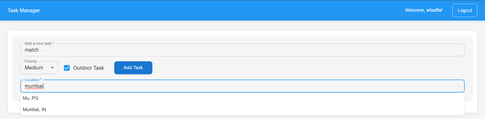

# Task Management Application

A modern, responsive task management application built with React, Redux, and Material-UI. This application helps users organize their tasks with features like drag-and-drop functionality, weather integration for outdoor tasks, and priority management.

## Features

- **User Authentication**
  - Login/Logout functionality
  - Persistent authentication state
  - Welcome message with user name

- **Task Management**
  - Create, edit, and delete tasks
  - Drag-and-drop task organization
  - Three-column layout (To Do, In Progress, Completed)
  - Priority levels (High, Medium, Low)
  - Task status tracking

- **Weather Integration**
  - Add location to outdoor tasks
  - Real-time weather information
  - Weather-based task recommendations

- **Responsive Design**
  - Mobile-first approach
  - Adapts to different screen sizes
  - Touch-friendly interface
  - Custom scrollbars

- **Modern UI/UX**
  - Clean and intuitive interface
  - Material Design components
  - Smooth animations and transitions
  - Custom theme with consistent styling

## Screenshots

### Login Screen


### Main Dashboard


### Task Management


### Weather Integration


## Prerequisites

- Node.js (v14 or higher)
- npm (v6 or higher)
- Modern web browser

## Installation

1. Clone the repository:
```bash
git clone https://github.com/yourusername/task-management-app.git
cd task-management-app
```

2. Install dependencies:
```bash
npm install
```

3. Create a `.env` file in the root directory and add your OpenWeatherMap API key:
```env
REACT_APP_WEATHER_API_KEY=your_api_key_here
```

## Running the Application

1. Start the development server:
```bash
npm start
```

2. Open your browser and navigate to:
```
http://localhost:3000
```

## Project Structure

```
task-management-app/
├── public/
├── src/
│   ├── components/
│   │   ├── DraggableTask.jsx
│   │   ├── Login.jsx
│   │   ├── TaskInput.jsx
│   │   └── TaskList.jsx
│   ├── store/
│   │   ├── slices/
│   │   │   ├── authSlice.js
│   │   │   └── taskSlice.js
│   │   └── store.js
│   ├── styles/
│   │   ├── global.css
│   │   └── theme.js
│   ├── App.jsx
│   └── index.js
├── .env
├── package.json
└── README.md
```

## Technologies Used

- React
- Redux Toolkit
- Material-UI
- React DnD
- OpenWeatherMap API
- Local Storage for persistence

## Features in Detail

### Task Management
- Create new tasks with priority levels
- Drag tasks between columns to update status
- Edit task details
- Delete tasks
- Filter tasks by priority and status

### Weather Integration
- Add location to outdoor tasks
- View current weather conditions
- Get weather-based recommendations
- Update weather information

### User Interface
- Clean, modern design
- Responsive layout
- Custom theme
- Smooth animations
- Loading states
- Error handling
- Success notifications

## Contributing

1. Fork the repository
2. Create your feature branch (`git checkout -b feature/AmazingFeature`)
3. Commit your changes (`git commit -m 'Add some AmazingFeature'`)
4. Push to the branch (`git push origin feature/AmazingFeature`)
5. Open a Pull Request

## License

This project is licensed under the MIT License - see the LICENSE file for details.

## Acknowledgments

- Material-UI for the component library
- OpenWeatherMap for the weather API
- React DnD for drag-and-drop functionality

## Support

For support, please open an issue in the GitHub repository or contact the maintainers.
